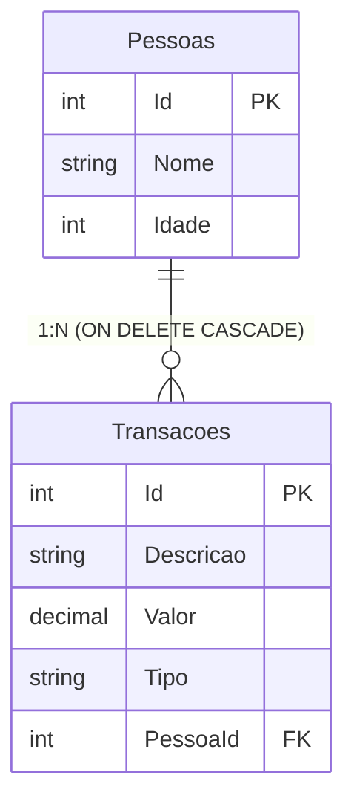
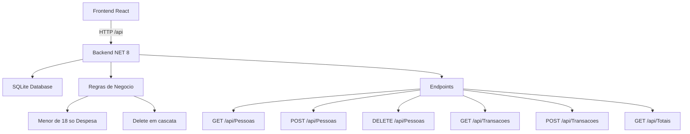
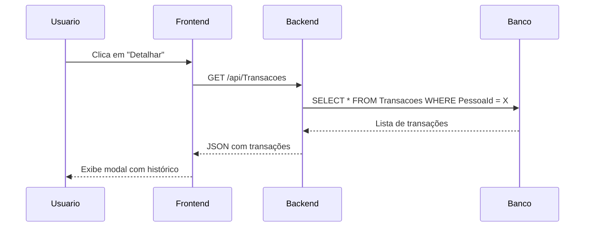

# controle-gastos-residenciais
[](https://github.com/paulotelss/controle-gastos-residenciais/actions/workflows/ci.yml)


## Modelagem do Banco de Dados



## Arquitetura do Sistema



## Fluxo de Detalhamento (Modal)




## Como testar a aplicação

### Testando a API (Swagger)

Com o back-end rodando, acesse:
Ex: http://localhost:[numero_porta_exibido_terminal]/swagger


Lá você pode testar todos os endpoints da API:

| Endpoint | Método | Descrição |
| :--- | :--- | :--- |
| `/api/Pessoas` | GET | Lista todas as pessoas |
| `/api/Pessoas` | POST | Cria uma nova pessoa |
| `/api/Pessoas/{id}` | DELETE | Deleta uma pessoa (e todas as suas transações) |
| `/api/Transacoes` | GET | Lista todas as transações |
| `/api/Transacoes` | POST | Cria uma nova transação (com validação de idade) |
| `/api/Totais` | GET | Consulta totais por pessoa e totais gerais |

### Testando a interface web

Com o front-end rodando, acesse:
Ex: http://localhost:[numero_porta_exibido_terminal]


## Como executar o projeto

### Pré-requisitos
- [.NET 8 SDK](https://dotnet.microsoft.com/download)
- [Node.js 18+](https://nodejs.org/)

### Back-end
```bash
cd controle-gastos/backend/ControleGastosAPI
dotnet restore
dotnet run
```

### Front-end
```bash
cd controle-gastos/frontend
npm install
npm run dev
```

---


## 📹 Vídeo de demonstração

[](https://youtu.be/mkS9nGcczgE)
